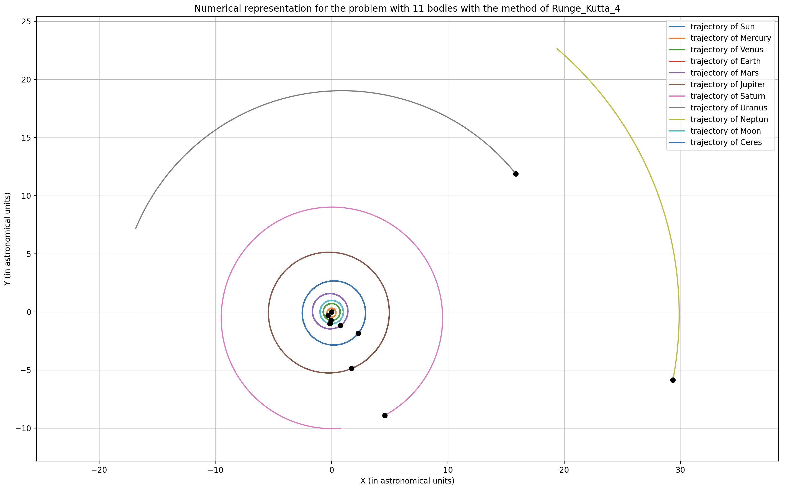

# N-Bodies Problem

This project tackles the N-bodies problem, implementing three numerical methods: **Euler Explicit**, **Runge-Kutta 2**, and **Runge-Kutta 4**. Using real data from the NASA Database, this code can simulate and visualize the motion of celestial bodies in the Solar System. You can plot various scenarios such as:

- The Solar System
- The trajectories of **Voyager 1** and **Voyager 2**
- The path of **Halley's Comet**

These examples help to illustrate the complex gravitational interactions between multiple bodies in space.

  

